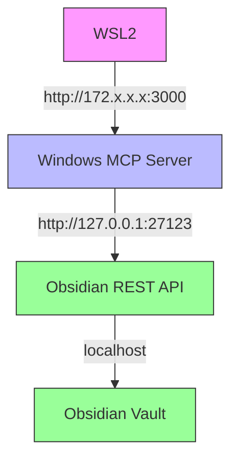

# Troubleshooting

Common issues and solutions for Obsidian HTTP MCP.

---

## Connection Issues

### WSL2: Connection refused

**Symptom:** `ECONNREFUSED` when connecting from WSL2 to Windows.

**Solution:** Use Windows bridge IP instead of localhost.

**Step 1 - Find Windows bridge IP:**

On **Windows PowerShell** (not WSL2):

```powershell
ipconfig | findstr "IPv4"
# Look for "vEthernet (WSL)" interface
# Example: IPv4 Address. . . . . . . . . . . : 172.19.32.1
```

**Step 2 - Reconnect your AI from WSL2:**

```bash
claude mcp add -s user --transport http obsidian-http http://YOUR_IP:3000/mcp  # Adapt to your AI
# Replace YOUR_IP with the IP from Step 1
# The -s user flag ensures global installation (not project-local)
```

> **Important**: The MCP server must run on the same system as Obsidian (Windows in this case), not on WSL2. This is because the server needs to access Obsidian's REST API at `127.0.0.1:27123`, which is only accessible from Windows localhost.

---

### Windows Firewall blocks WSL2

**Symptom:** Connection timeout from WSL2 → Windows port 3000.

**Solution:** Add firewall rule for port 3000.

```powershell
# Run as Administrator
New-NetFirewallRule -DisplayName "Obsidian MCP Server" -Direction Inbound -LocalPort 3000 -Protocol TCP -Action Allow
```

---

### Port already in use

**Symptom:** `EADDRINUSE: address already in use :::3000`

**Solution 1 - Change port:**

```bash
obsidian-http-mcp --port 3001
```

**Solution 2 - Kill process on port 3000:**

```bash
# Linux/WSL2
lsof -ti:3000 | xargs kill -9

# Windows
netstat -ano | findstr :3000
```powershell
# Find the process ID (PID) first:
netstat -ano | findstr :3000

# Then kill the process (replace 1234 with actual PID):
taskkill /PID 1234 /F
```

---

## Understanding the Architecture

### Why MCP server on Windows (not WSL2)?



**Key points:**

- Obsidian REST API only listens on `127.0.0.1:27123` (Windows localhost)
- If MCP server ran on WSL2, it couldn't access Windows localhost
- MCP server on Windows can access Obsidian locally
- Your AI on WSL2 accesses Windows server via bridge IP

```text
                  │ Bridge IP (172.19.x.x.x:3000)
                  ↓
┌─────────────────────────────────────────────┐
│              WSL2                           │
│                                             │
│  Your AI (e.g., Claude Code)                │
│    - Connects to [http://172.19.x.x.x:3000](http://172.19.x.x.x:3000)  │
└─────────────────────────────────────────────┘
```

**Key points:**

- Obsidian REST API only listens on `127.0.0.1:27123` (Windows localhost)
- If MCP server ran on WSL2, it couldn't access Windows localhost
- MCP server on Windows can access Obsidian locally
- Your AI on WSL2 accesses Windows server via bridge IP

### Why port 3000 (not 27123 directly)?

- **Port 27123** = Obsidian REST API (custom HTTP protocol)
- **Port 3000** = MCP Server (MCP protocol)

These are **different protocols**. The MCP server acts as a **translator/proxy**:

1. **Input**: MCP protocol requests from your AI (port 3000)
2. **Process**: Translates to Obsidian REST API calls
3. **Output**: Contacts Obsidian at `127.0.0.1:27123`
4. **Return**: Formats responses back to MCP protocol

Your AI cannot talk directly to Obsidian REST API - it needs the MCP server to translate between protocols.

---

## Authentication Issues

### Invalid API key

**Symptom:** `401 Unauthorized` from Obsidian REST API.

**Solution:** Verify API key in Obsidian plugin settings.

1. Obsidian → Settings → Community Plugins → Local REST API
2. Copy the API key exactly (no spaces)
3. Run `obsidian-http-mcp --setup` and paste key

---

### API key not found

**Symptom:** `Error: API key not found. Please run "obsidian-http-mcp --setup"`

**Solution:** Run setup wizard or set environment variable.

```bash
# Option 1: Setup wizard
obsidian-http-mcp --setup

# Option 2: Environment variable
export OBSIDIAN_API_KEY=your_key_here
obsidian-http-mcp

# Option 3: CLI argument
obsidian-http-mcp --api-key your_key_here
```

---

## Server Issues

### Server not responding

**Symptom:** Your AI shows "Connection timed out" or server health check fails.

**Checklist:**

1. Is server running? Check terminal for "Server is ready!"
2. Test health endpoint: `curl http://localhost:3000/health`
3. Check firewall rules (Windows)
4. Verify port not blocked by antivirus

**Restart server after reboot:**

```bash
obsidian-http-mcp
# Keep terminal running
```

---

### Obsidian API not accessible

**Symptom:** Server starts but cannot reach Obsidian (ECONNREFUSED to port 27123).

**Solution:** Verify Obsidian REST API plugin is enabled and running.

1. Obsidian → Settings → Community Plugins
2. Enable "Local REST API" plugin
3. Check plugin shows "Server running on port 27123"
4. Test: `curl http://127.0.0.1:27123/` (should return vault info)

---

## AI Connection Issues

### MCP server not detected

**Symptom:** Your AI shows server disconnected or missing.

**Solution:** Re-add MCP server.

```bash
# Remove old connection (example with Claude Code)
claude mcp remove obsidian-http  # Adapt to your AI

# Add new connection (adjust URL for your setup)
claude mcp add --transport http obsidian-http http://localhost:3000/mcp  # Adapt to your AI
```

---

### Tools not showing in your AI

**Symptom:** Your AI doesn't recognize MCP tools (list_files, read_file, etc.).

**Solution:** Restart your AI session.

```bash
# Exit and restart your AI
# Tools should now be available
```

---

## Network Debugging

### Check server is listening

```bash
# Linux/WSL2
netstat -tuln | grep 3000
# Should show: 0.0.0.0:3000 LISTEN

# Windows
netstat -an | findstr :3000
```

### Test MCP endpoint

```bash
# Should return MCP protocol info
curl -X POST http://localhost:3000/mcp \
  -H "Content-Type: application/json" \
  -d '{"jsonrpc":"2.0","id":"1","method":"tools/list"}'
```

### Check Obsidian API

```bash
# Should return vault structure (needs API key)
curl http://127.0.0.1:27123/ \
  -H "Authorization: Bearer YOUR_API_KEY"
```

---

## Still Having Issues?

1. Check [GitHub Issues](https://github.com/NasAndNora/obsidian-http-mcp/issues)
2. Enable verbose logging: `DEBUG=* obsidian-http-mcp`
3. Create new issue with:
   - OS/environment (Windows/WSL2/Linux/Mac)
   - Error message
   - Output of health check
   - Steps to reproduce

---

